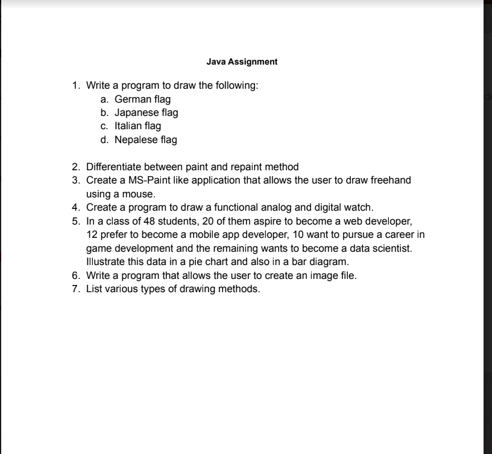
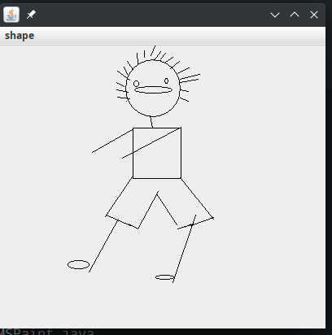
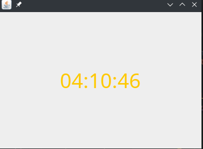
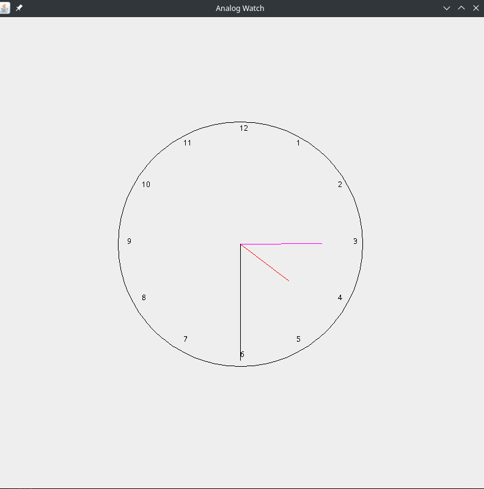
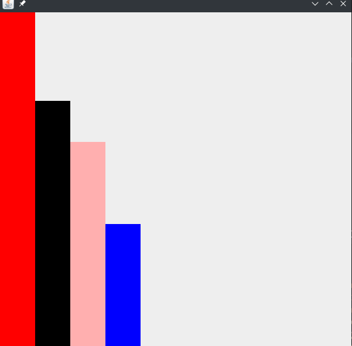
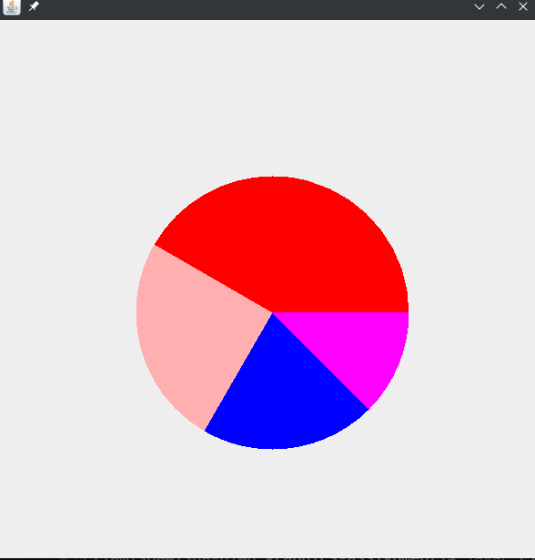
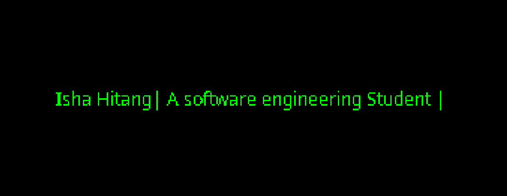
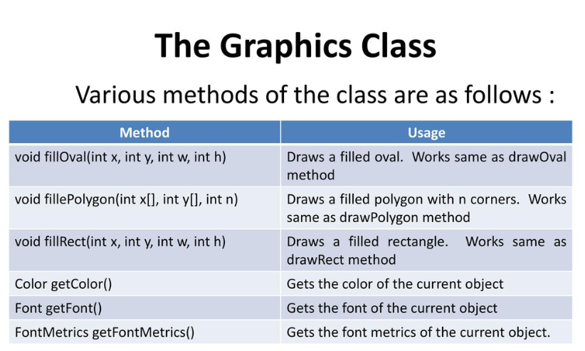

# JAVA-Grpahics Assignment

# Questions:- 

# Question no 1. Write  a program to draw the following 

        1. German Flag

        Code:- GermanFlag.java

        2. Japanese Flag

        Code:- JapaneseFlag

        3. Italian Flag

        Code:- ItalianFlag.java

        4. Nepal Flag

        Code:- NepalFlag.java

# 2. Differentiate between paint and repaint method.

### paint() vs repaint()

-  paint() method is the method of the AWT/Swing component class that is `called by the system` to render the component on the screen whereas repaint() method is the method of the AWT/Swing component class that is used to `request the system to call the paint()` method.

- The paint() method is `automatically invoked by the system` when a component needs to be rendered whereas the repaint() method is `manually invoked by the programmer` when a component needs to be scheduled for repainting.

- The paint() method is `less efficient` since it requires more processing power whereas the repaint() method is `more efficient` since it only update the areas that have changed.

- The paint() method is `not generally recommended` to use in the java GUI programming whereas the repaint() method is `recommended` to use in the modern Java GUI programming.

- The paint() method can be `overriden by the programmer` to customize the way a component is painted whereas the repaint() method is `predefined that cannot be customized`.

- The paint() method can cause the `flickering` whereas the repaint() methods `avoids the flickering`.

# 3. Create a MS-Paint like application that allows the user to draw freehand using a mouse.

SourceCode:- MSPaint.java

Output:- 

# 4. Create a program to draw functional analog and digital watch.

SoureceCode:- DigitalWatch.java

Output:- 

SourceCode:- AnalogWatch.java

Output:- 

# 5. In a class of 48 students, 20 of them aspire to become the web developer, 12 prefer to become a mobile app developer, 10 want to persue a career in game devlopment and the remaining wants to become a data scientists. Illustrate these data in a piechart and also in a bar diagram.

SourceCode:- BarDiagram.java

Output:-

SourceCode:- PieChart.java

Output:-

# 6. Write a program that allows the user to create an image file.

SourceCode:- OwnImage.java

Output:- 

# 7. List various types of drawing methods

# 
# 
#
                                                   Thank You :)