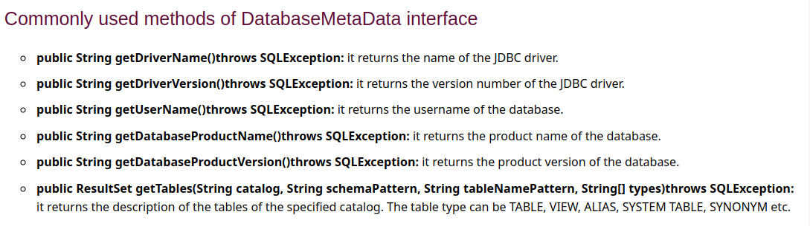

# Question no 1:Define JDBC.Explain its types.

JDBC is the Java Database Connectivity or the Java API that

* Connects to a database and execute queries with the database.

* Enabales us to write Java program to access any kind of tabular data stored in a relational database.

* Is a part of JavaSE(Standard Edition)

JDBC Drivers are of four different types:

        1. JDBC-ODBC bridge driver

        2. Native-API driver (partially java driver)

        3. Network Protocol driver (fully java driver)

        4. Thin driver (fully java driver)

**1) JDBC-ODBC bridge driver/Type-1**

* JDBC-ODBC Driver is also called the Type-1 Driver or Bridge Driver.
* JDBC-ODBC Driver is the Driver provided by Sun Microsystem as implementation of Driver Interface.
* JDBC-ODBC Driver has provided with the inter dependent on the Microsoft's product ODBC Driver.
* The Type-1 Driver converts JDBC method calls into ODBC function calls.
* The Driver is no longer in use from Java 8.00 version.
* Not written in java.

**Advantages**

 * It is easy to use.

 * can be easily connected to any database.

**Disadvantages**

● Performance degraded because JDBC method call is converted into the ODBC function calls.

● The ODBC driver needs to be installed on the client machine.

**2) Native-API driver**

The Native API driver uses the client-side libraries of the database. The driver converts
JDBC method calls into native calls of the database API. It is not written entirely in java.

**Advantage:**

● performance upgraded than JDBC-ODBC bridge driver.

**Disadvantage:**

● The Native driver needs to be installed on the each client machine.

● The Vendor client library needs to be installed on client machine.

**3) Network Protocol driver**

The Network Protocol driver uses middleware (application server) that converts JDBC calls directly
or indirectly into the vendor-specific database protocol. It is fully written in java.

**Advantage:**

● No client side library is required because of application server that can perform many tasks
like auditing, load balancing, logging etc.

**Disadvantages:**

● Network support is required on client machine.

● Requires database-specific coding to be done in the middle tier.

● Maintenance of Network Protocol driver becomes costly because it requires
database-specific coding to be done in the middle tier.

**4) Thin driver**

The thin driver converts JDBC calls directly into the vendor-specific database protocol. That
is why it is known as thin driver. It is fully written in Java language.

**Advantage:**

● Better performance than all other drivers.

● No software is required at client side or server side.

**Disadvantage:**

● Drivers depend on the Database.

 # Question no 2:Differentiate between JDBC and ODBC.

JDBC VS ODBC

# Question no 3:Explain the components of JDBC.

The JDBC API provides the following interfaces and classes :- 

**● DriverManager** − This class manages a list of database drivers. Matches connection
requests from the java application with the proper database driver using communication sub
protocol. The first driver that recognizes a certain subprotocol under JDBC will be used to
establish a database Connection.

**● Driver**  This interface handles the communications with the database server. You will
interact directly with Driver objects very rarely. Instead, you use DriverManager objects,
which manages objects of this type. It also abstracts the details associated with working with
Driver objects.

**● Connection** − This interface with all methods for contacting a database. The connection
object represents communication context, i.e., all communication with database is through
connection object only.

**● Statement** − You use objects created from this interface to submit the SQL statements to the
database. Some derived interfaces accept parameters in addition to executing stored
procedures.

**● ResultSet** − These objects hold data retrieved from a database after you execute an SQL
query using Statement objects. It acts as an iterator to allow you to move through its data.

**● SQLException** − This class handles any errors that occur in a database application.

# Question no 4: Write a menu driven program that allows users to do following 
# a. Display all the records.
# b. Display the total number of records.
# c. Ask the user to enter a name and display the number of records with the given name.
# d. Display the average marks of the students.
# e. Ask the user to enter a faculty  and print the average marks of the students enrolled in that faculty.

## Solution:- ConnectDb.java

# Question no 5: Write a program to insert record into above mentioned table until the user types 'exit'.

## Solution:- InsertIntoDb.java

# Question 6:Explain ResultSet, ResultSetMetadata and DatabaseMetaData.

**ResultSet**

The SQL statements that read data from a database query, return the data in a result set.
The SELECT statement is the standard way to select rows from a database and view them in
a result set. The java.sql.ResultSet interface represents the result set of a database query.

**ResultSetMetaData**

The metadata means data about data i.e. we can get further information from the data.
If you have to get metadata of a table like total number of column, column name, column type etc. ,
ResultSetMetaData interface is useful because it provides methods to get metadata from the
ResultSet object.

**DatabaseMetaData**

The DatabaseMetaData interface provides methods to get information about the database you have
connected with like, database name, database driver version, maximum column length etc...

# Question no 7: Write a program to show how we can delete and update records  in a table.

## Solution: DeleteUpdateDb.java