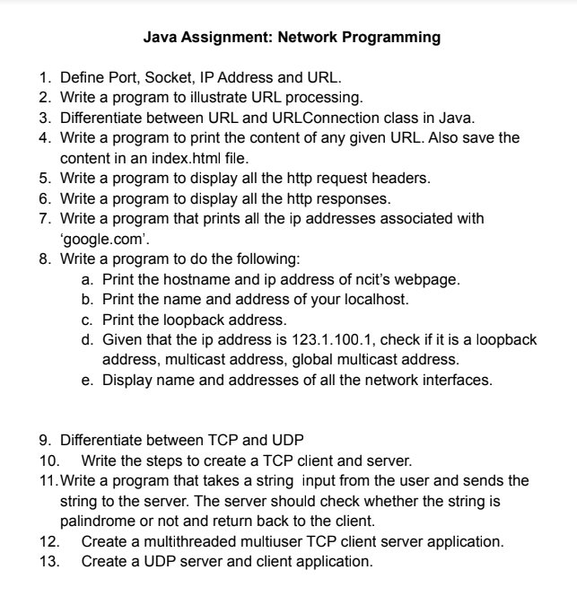

# Question no 1: Define Port, Socket, IP Address and URL.

## Port:-

        * Port is a logical construct.

        * Port is a number assigned to a processor running on a server

        * It is a 16-bit number unsigned integer range from (0-65535).

                From (0-1023), known as "system port or widely known port"

                From (1024-49159), known as "Reserved Port"

                Remaining ports(49159-65535), known as the "dynamic port or client port" used by client while connecting to server.

        * Only one application can run in a single port in a server.

        * Ports are used in transport layers.

        * example: HTTPS:80, HTTP:443, FTP:20.

## IP Addresses
        
        * An IP Addres is an address having information about how to reach a specific host which is a 32-bit unique address number having an address space of 2 ^ 32.
        
        * InetAddress is a class that allows us to work with the IP Addresses belongs to java.net package.

        * InetAddress is the base class of both Inet4Address(IPv4) and Inet6Address(IPv6)

        * Some of the methods present in InetAddress class are:- 

                a. public static InetAddress getByName(String host) throws UnknownHostException:-

                It returns the instances of the InetAddress class containing the LocalHost IP and Name

                b. public static InetAddress getByAddress(byte IPAdress[]) throws UnknownHostException:-
                
                It returns the instance of the InetAddress class created from the raw IP Address.

                c. public static InetAddress getLocalHost() throws UnknownHostException

                It returns the instances of the InetAddress class containing the localhost name and address

                d. public static InetAddress[] getAllByName(String hostName) throws UnknownHostException

                It returns the array of the instances of the InetAddress class which contains the IP Addresses.

        * Example porgram:- eg/InetAddressExam.java
 

## Socket:- 

        * Combination of IP address and Port number is called the the Socket.

        * Socket is the end point for the communication.

        * Different types of the Socket are:

                a. TCP Socket 

                b. Datagram Socket

                c. Raw Socket Interface

        * It works as an interface between an Application layer and Transport Layer

## URL Class

* It is a class that is used to represent URL
* It is a package of java.net.
* A url is devided into the many sections;

* Example program 💯

         eg/URLMthod.java

**output://**

         Protocol:- https
    
         Domain/Host:- www.github.com

         Authority:- www.github.com:3000

         Port Number:- 3000

         Default Port Number:- 443

         Path:- /iamisha

         File:- /iamisha?tab=repositories

         Query String :- tab=repositories

          Anchor/Reference:- git
  
          URI:-https://www.github.com:3000/iamisha?tab=repositories#git

          URL String:- https://www.github.com:3000/iamisha?tab=repositories#git

# Question no 2: Write a program to process URL processing.

## Solution:- 

        eg/URLMethod.java

## Output:- 

        1. Protocal:- https

        2. Host/Domain:- www.github.com

        3. Host Authority:- www.github.com:3000

        4. Port:- 3000

        5. Default Port:- 443

        6. Path:- /iamisha

        7. File:- /iamisha?tab=repositories

        8. Reference/Anchor:- git

        9. Query String:- tab=repositories

        10. URI:- https://www.github.com:3000/iamisha?tab=repositories#git 

# Question no 3: Differentiate between URL and URLConnection class in java

- **URL** is the class that is used to represent a url where the **URLConnection** is the class that is used to represent the communication between  a url and an application.

# Question no 4: Write a program to print the content of any given URL. Also save the content in an index.html file.

## Solution:-
        
         eg/URLConnectionExam.java

# Question no 5: Write  a program to display the HttpRequest Headers.

## solution:- 

        HttpRequestHeaders.java

# Question no 6: Write a program to print all the Http Responses.

## Solution:- 

        HttpResponses.java

## Output:- 

        1. Response code:- 200

        2. Response message:- OK

        3. Connection timeout:- 0

        4. Encoding:- null
        
        5. Length of content:- -1

        6. Request type:- GET

        7. Date:- 1674213904000

# Question no 7. Write a program that prints all the ip addresses associated with 'google.com'.

## Solution: <u>IPAddressofGoogle.java</u>

# Question no 8: Write a program to do the following:
# a. Print the hostname and ip address of ncit’s webpage.
# b. Print the name and address of your localhost.
# c. Print the loopback address.
# d. Given that the ip address is 123.1.100.1, check if it is a loopback
# address, multicast address, global multicast address.
# e. Display name and addresses of all the network interfaces.

## Solution:-       

        Address.java

# Question no 9: Differentiate between TCP and UDP.

# Question no 10: Write the steps to create the TCP Client and Server.

# Question no 11:- Write a program that takes a string input from the user and sends the string to the server. The server should check whether the string is palindrome or not and return back to the client.

## Solution:-

         CheckPalindromeServer.java

         CheckPalindromeClient.java

# Question no 12. Create a multithreaded multiuser TCP client server application.

## solution:- 

        MultiThreadTCP.java

        MultiThreadClient.java

# Question no 13: Create a UDP server and client application.

