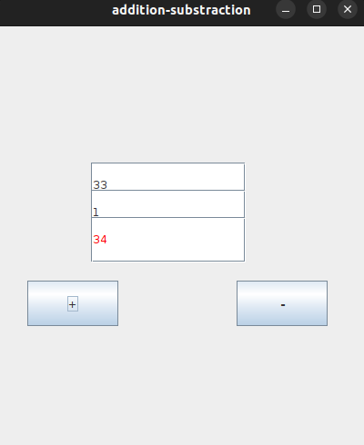
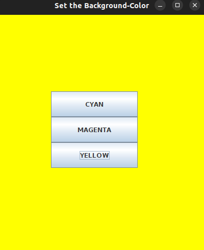
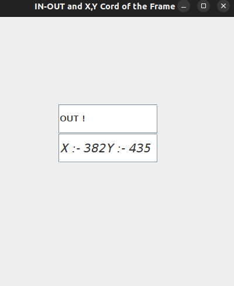

# THEORY

**Java Event Handling**

- It is of two different types.

  a.Java MouseListener Interface

       - The Java MouseListener is notified whenever you change the state of the mouse.

       - It is notified against MouseEvent.

       - The MouseListener interface is found in java.awt.event package.

       - It has five different methods
                 i. public abstract void mouseClicked(MouseEvent e);

                 ii. public abstract void mouseEntered(MouseEvent e);

                 iii. public abstract void mouseExited(MouseEvent e);

                 iv. public abastract void mousePressed(MouseEvent e);

                 v. public abastract void mouseReleased(MouseEvent e);

  b. Java MouseMotionListener Interface

        - The Java MouseMotionListener is notified whenever you move or drag mouse.

        - It is also notified agaisnt MouseEvent.

        - it is found in java.awt.event package.

        - It has two methods

                 i. public abstract void mouseMoved(MouseEvent e);

                 ii. public abstract void mouseDragged(MouseEvent e);

# Questions of the lab day -4:-

- Write a Java Program to create three TextFields, two fields to get the user inputs and one field to show the result also create two buttons, one button for the sum operation and another for the substract operation. When a user clicks the sum button it should perform the sum of two numbers and display the result in another text fields whereas clicking the substract button it should perform the the substraction of two numbers and display the result in another text fields.Also change the color of result of substraction into the blue and of the addition to the red.

===> Answer:- **Sumandsubs.java**

**Output of the above program**

- Write a Java Program to create three buttons. On clicking those buttons, change the background color of the Frame, different color with different buttons.

===> Answer:- **SetBackGroundColor.java**

**Output of the above program**

- Create a Frame with two TextFields, one of which should show whether the mose is inside or outside the Frame and the other TextField should display X and Y coordinate of the pointer when the user moves the mouse pointer inside the Frame. Set the result of the first TextField into the Font Arial with bold font having font size 20 and also set the second TextField into the Font New Roman with italic font having font size of 20px.

===>Answer:- **MouseListenerExam.java**

**Output of the above program**

