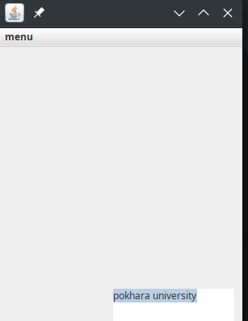
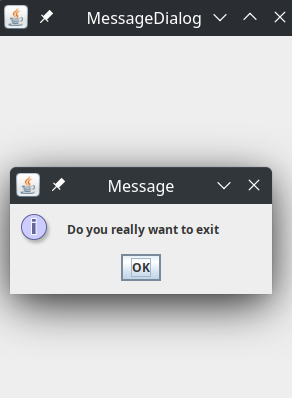

# lab 5 programming questions and answeres :- 

* Question no. 1:- Write a Java program to create a menu having the MenuItems select All, copy, cut, paste and exit with some text in TextArea.

        Answer:- MyMenu.java

* Question no. 2:- Write a Java program to create a dynamic menu with the same MenuItems select All, Copy, Cut, Paste and Exit with some texts in TextArea.

        Answer:- MyDynamicMenu.java

* Question no. 3:- Write a Java program to ask the user if he really wants to close the program or not by using the messageDialog  when the user clicks the cross button of the Frame.

        Answer:- MyMessageDialog.java

