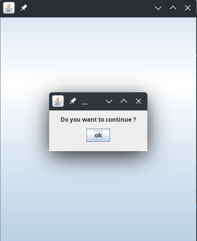
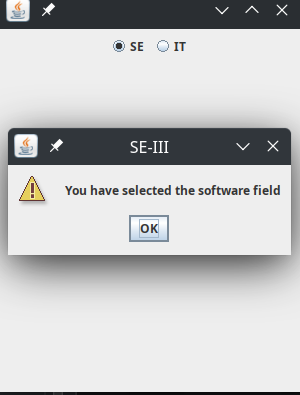

# `Programming Questions of lab 6`

**Question no. 1:- Write a Java Program  to create your own JOptionPane that shows the normal messageDialog.** 

Answer:- MyOwnDialog.java

**Question no. 2:- Write a Java Program to create your own JOptionPane that shows the normal messageDialog in which display the result what the user have selectd either SE or IT by making the two RadioButtons se and it.**

Answer:- MyOwnDialogWithRadio.java

